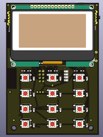

## STM32 Console  
At the beginning it was a game console project on STM32, but then I found out 
about Anbernic devices. Now this is a debugging device for STM32F103Cx 
microcontrollers (STM32F103C6, C8, CB, maybe C4, but too little memory).  
   

---
The console has:  
+ display;  
+ buttons;  
+ temperature sensor LM75B;  
+ RTC module DS3231M;  
+ 4 LEDs;  
+ vibration motor;  
+ external speaker;  
+ radio module NRF24L01;  
+ bluetooth module JDY-23;  
+ interface converters: RS-232, RS-485 (with terminator 120 Ohm), USB-UART.  

---
The external connector gives access to connect:  
+ 4 digital inputs/outputs;  
+ 2 PWM outputs;  
+ 1 analog input (max 6V, if you need more, connect a resistor in series, see the scheme for details);  
+ SPI, I2C, UART;  
+ RS-232, RS-485.  

Pinout (IDC-26M):  
| Pin | Name          | Description                                                      |
|-----|---------------|------------------------------------------------------------------|
| 1   | 5V            | Output from TP5400                                               |
| 2   | Vdd           | From usb or for power input                                      |
| 3   | 3.3V          | Output from AMS1117                                              |
| 4   | 5V            | Output from TP5400                                               |
| 5   | Analog input  | Max 6V, or use resistor for increase voltage divider             |
| 6   | PWM2          | PWM output or GPIO PORTB.9, limited 1k Ohm                       |
| 7   | GPIO PORTA.12 | Limited 1k Ohm                                                   |
| 8   | PWM1          | PWM output or GPIO PORTB.8, limited 1k Ohm                       |
| 9   | GPIO PORTA.11 | Limited 1k Ohm                                                   |
| 10  | SPI CS        | To connect an external device or GPIO PORTB.12, limited 1k Ohm   |
| 11  | GPIO PORTA.10 | Limited 1k Ohm                                                   |
| 12  | SPI MOSI      |                                                                  |
| 13  | GPIO PORTA.9  | Limited 1k Ohm                                                   |
| 14  | SPI SCK       |                                                                  |
| 15  | SPI MISO      |                                                                  |
| 16  | Data+         | Noninverting Receiver Input A / Driver Output A (for MOXA Data-) |
| 17  | I2C SCL       |                                                                  |
| 18  | Data-         | Inverting Receiver Input B / Driver Output B (for MOXA Data+)    |
| 19  | I2C SDA       |                                                                  |
| 20  | GND           |                                                                  |
| 21  | UART RX       | Also connect to driver RS-485 and USB                            |
| 22  | UART TX       | Also connect to driver RS-485 and USB                            |
| 23  | RS-232 RX     |                                                                  |
| 24  | RS-232 TX     |                                                                  |
| 25  | GND           |                                                                  |
| 26  | GND           |                                                                  |

---
#### Scheme:  
[Scheme_v0.1](docs/game_pad_keyboard_v0.1.pdf)  

#### PCB:  
   

#### Gerber:  
Archive for production:  
[gerber_v0.1](https://github.com/piro-s/stm32_console/raw/master/gerber/gerber_v0.1.zip)  
